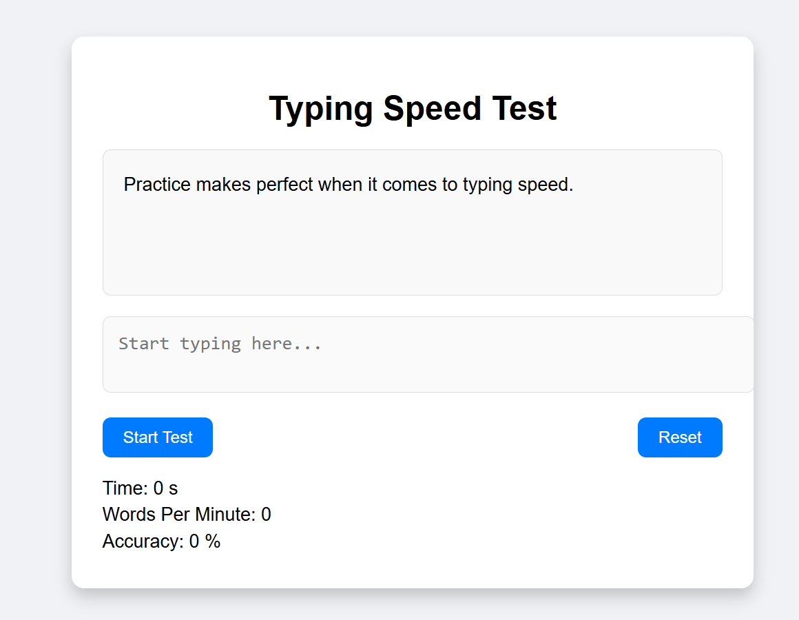

# Typing Speed Test Game 

## live: https://fahim-fm.github.io/Project-3-typing-speed-test/

A web-based **Typing Speed Test Game** built using **HTML, CSS, and JavaScript**. Measure your typing speed, accuracy, and overall typing performance in real-time.

---

## ✨ Features

- Real-time **typing speed** and **accuracy** measurement
- **Countdown timer** before test starts (3-2-1)
- **Correct/Incorrect character highlighting**
- **Automatic test completion** when sentence is fully typed
- **Final results modal** showing:
  - Total time
  - Words per minute (WPM)
  - Accuracy (%)
- **Reset button** for a new test
- Responsive and user-friendly design

---

## 🛠 Technologies Used

- **HTML5** - Structure and layout  
- **CSS3** - Styling, animations, and modal design  
- **JavaScript (ES6)** - Typing logic, countdown timer, real-time results  

---

## ⚙ How It Works

1. **Start the Test**
   - Click **Start Test**, countdown begins.
   - Textarea enabled after countdown.

2. **Typing & Real-time Feedback**
   - Correct characters: green  
   - Incorrect characters: red  
   - Time, WPM, and accuracy update in real-time.

3. **End of Test**
   - Automatically completes when text is fully typed.
   - Final results displayed in a modal.

4. **Reset**
   - Click **Reset** to start a new test with a new sentence.

